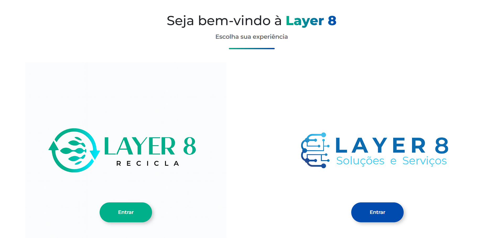

<p align="center">
  
</p>

<h1 align="center">Layer8 Website</h1>

<p align="center">
  Modern institutional website developed for Layer8 using React and SCSS.
</p>

<p align="center">
  
  
  
  
</p>

---

## 📖 About

Layer8 Website is the official institutional website developed for **Layer8**, a technology company based in Rio Grande do Norte, Brazil.

The project was built as a modern, responsive Single Page Application using React while supporting multiple internal pages through URL query parameters.

Instead of using multiple routes, the application dynamically renders content according to:

```
?p=landing
?p=recicla
?p=tecnologia
```

Each URL is directly shareable, allowing visitors to access each section independently while keeping the project lightweight and entirely frontend-based.

---

## ✨ Features

- Responsive design
- Three internal pages
- Query parameter navigation
- Fully modular component structure
- Dynamic page rendering
- Service cards
- Contact form
- SEO-friendly structure
- Reusable SCSS modules

---

## 🖼 Preview

### Landing



### Tecnologia


### Recicla


---

## 🛠 Technologies

- React
- SCSS
- Bootstrap
- Vite
- JavaScript

---

## 🚀 Getting Started

Clone the repository

```bash
git clone https://github.com/ChaseKnx/Layer8.git
```

Install dependencies

```bash
npm install
```

Start the development server

```bash
npm run dev
```

---

## 📁 Project Structure

```
src/
 ├── assets/
 ├── landing/
 ├── page/
 ├── Reboot.jsx
 └── App.jsx
```

---

## 👨‍💻 Author

Developed by **Chase**
